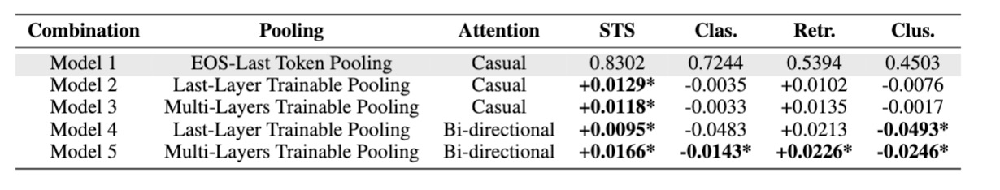
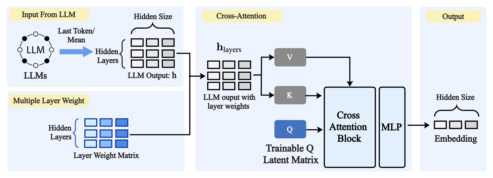

## Pooling And Attention: What Are Effective Designs For LLM-Based Embedding Models?

<div align="center" style="display: block; margin-left: auto; margin-right: auto; width: 80%;">
    
</div>

### 💡Introduction
In this study, we conduct a large-scale experiment by training a series of LLM-based embedding models using the same training data and base model but differing in their pooling and attention strategies. The results show that there is no one-size-fits-all solution: while bidirectional attention and an additional trainable pooling layer outperform in text similarity and information retrieval tasks, they do not significantly surpass simpler designs like EOS-last token pooling and default causal attention in clustering and classification tasks.Furthermore, we propose a new pooling strategy, Multi-Layers Trainable Pooling, which transforms the outputs of all hidden layers, rather than just the last layer,
using a cross-attention network.
<div align="center" style="display: block; margin-left: auto; margin-right: auto; width: 80%;">
    
</div>

📚 **Paper Link:** [Pooling And Attention: What Are Effective Designs For LLM-Based Embedding Models?"](https://arxiv.org/abs/2409.02727)

## 💻 Codes

### Data
Training Data is hosted on HuggingFace: [yixuantt/ir_data](https://huggingface.co/datasets/yixuantt/ir_data)

You can also use custom training data in the following format:
```
{
    "query":"",
    "postive":"",
    "negative":"",
}
```

### Training 
In the experiment, we consider the following five design combinations:
* Model 1: EOS-Last Token Pooling + Causal Attention
* Model 2: Last-Layer Trainable Pooling + Causal Attention
* Model 3: Multi-Layers Trainable Pooling+ Causal Attention
* Model 4: Last-Layer Trainable Pooling + Bidirectional Attention
* Model 5: Multi-Layers Trainable Pooling+ Bidirectional attention

Different models have different trainers, so choose one to fit your needs.

```
export GPUS_PER_NODE=
export MASTER_ADDR=
export MASTER_PORT=
export NNODES=
export OUTPUT_PATH=

accelerate launch \
    --config_file accelerate_config.yaml \
    --main_process_ip $MASTER_ADDR \
    --main_process_port $MASTER_PORT \
    --num_processes $NUM_PROCESSES \
    --num_machines $NNODES \
    model1_trainer.py \  # Change Here
    --dataset_name yixuantt/ir_data \
    --max_seq_length 1024 \
    --model_name_or_path mistralai/Mistral-7B-v0.1 \
    --per_device_train_batch_size 1 \
    --per_device_eval_batch_size 1 \
    --learning_rate 1e-5 \
    --bf16 \
    --max_steps 1000 \
    --save_steps 100 \
    --save_total_limit 15 \
    --logging_steps 1 \
    --weight_decay 0.01 \
    --torch_dtype bfloat16 \
    --num_train_epochs 5 \
    --gradient_accumulation_steps  256 \
    --lr_scheduler_type linear \
    --warmup_steps 100 \
    --output_dir $OUTPUT_PATH
```

### Evaluation
Here are two Python scripts for the MTEB evaluation:   
```
python run_mteb.py
python run_mteb_retrieval.py
```
Please change the loaded model in the Python script for your evaluation:

```
from model_loaders.model1 import EmbedModel
```
Also, please change the loading path and results saving path.
```
base_model = "LLM Base Model"
adapter_path = "Lora Adapter"
output_dir = "Log File Path"
cache_dir = "Hugging Face Cache"
```
## 🌟 Trained Adapters:
Here are the Lora adapters used in the paper, please download from the link: 

[Download link](https://hkustconnect-my.sharepoint.com/:f:/g/personal/ytangch_connect_ust_hk/EnOlSfvqhyROvaZxjsR8_dcBh3ZHdw9r8Ge-ZwYlFH0CeQ?e=5GTxpV)

----
### Citation
```
@misc{poolingattentioneffectivedesigns,
      title={Pooling And Attention: What Are Effective Designs For LLm-Based Embedding Models?}, 
      author={Yixuan Tang and Yi Yang},
      year={2024},
      eprint={2409.02727},
      archivePrefix={arXiv},
      primaryClass={cs.CL},
      url={https://arxiv.org/abs/2409.02727}, 
}
```

